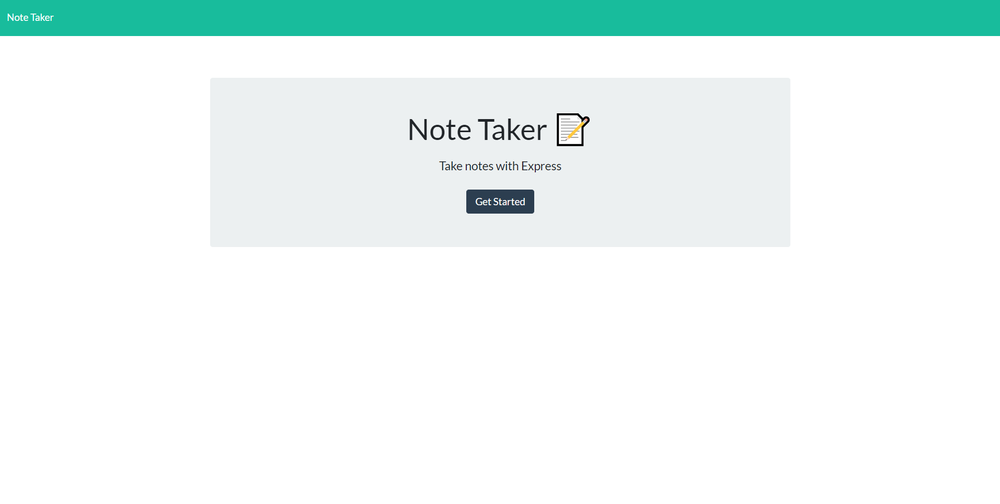
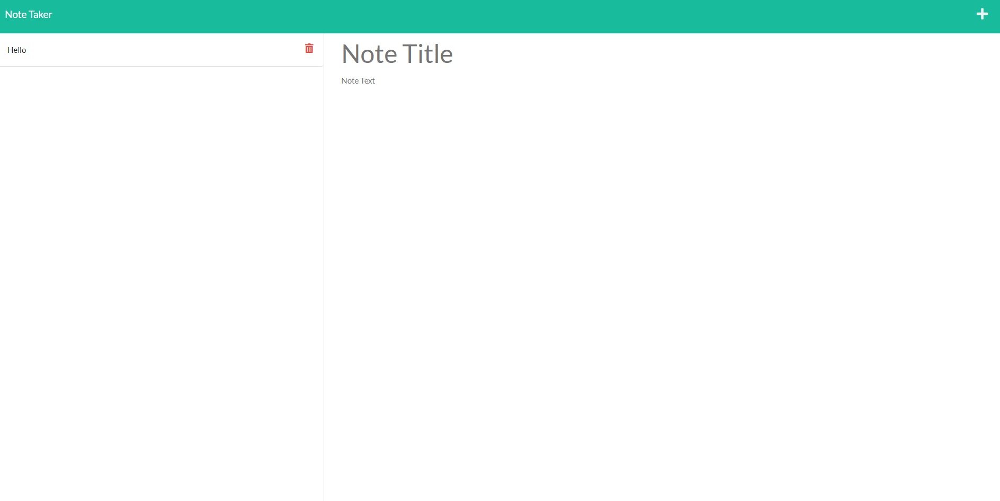

# Noted

## Purpose
Note taking application that saves your notes to a json file.

When clicking on an old note title from the left hand side, the note will then show up on the page.

## Built With
* HTML
* CSS
* JavaScript
* Node.JS
* Express.JS
* Deployed to Heroku

## Website
https://reidschroder.github.io/noted/

## Heroku
https://lit-ocean-30736.herokuapp.com/

## Preview

## Contribution
Reid Schroder